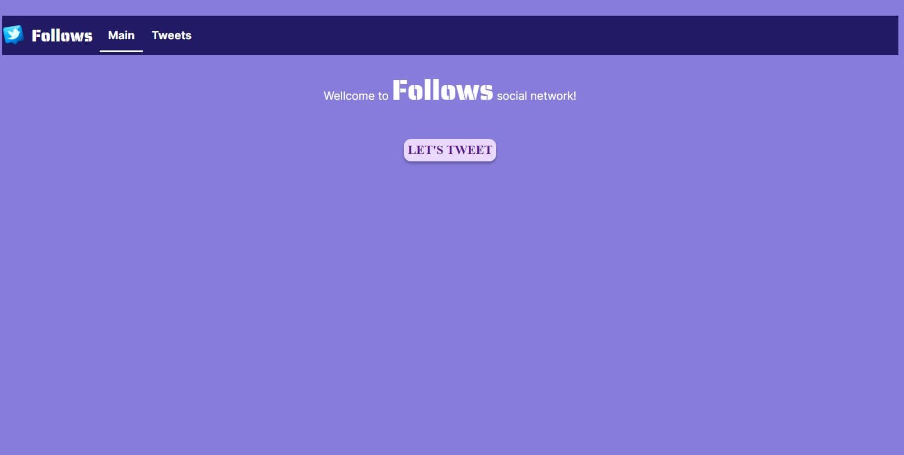
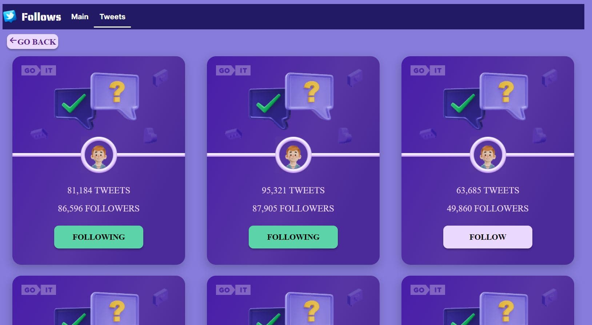
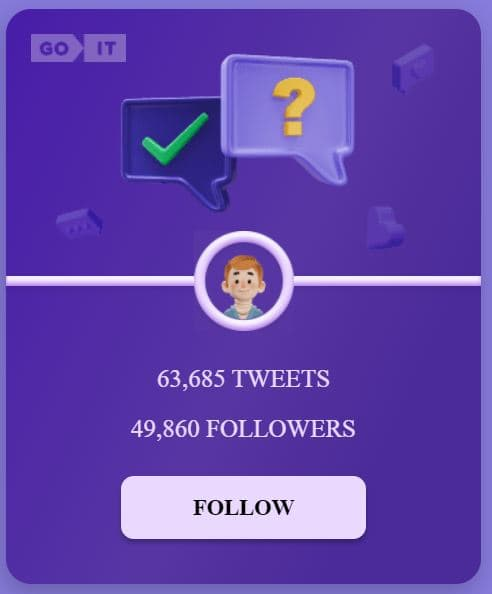

# Follows social network

## Technical Features

This App is made with React.

## Description

This is a Follows social network consist of cards of some users. Сlicking on the
button "follow" increases the number of followers and changing the label on the
button. After refreshing the page, the correct current data is displayed. Data
is stored on the backend mockAPI.

Main Page 

Users List 

User Card



User Card Following


## Deploy

[Link](https://practice-follows-project.vercel.app/)

## Project setup

```
npm install
npm run dev
```
